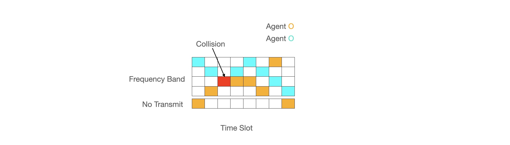

# deep-rl-spectrum-access



In this project I'm looking to solve the problem of uncoordinated spectrum access. As described in the [DARPA Collaboration Challenge](<https://www.darpa.mil/program/spectrum-collaboration-challenge>), the number of devices communicating using the RF spectrum continues to increase. Historically, there have been centralized rigid rules for what devices can access specific frequency bands at any given time. As the number of devices increases, we need to find ways to share the frequency spectrum more efficiently. Deep Reinforcement Learning (DRL) is a promising framework for autonomous agents to learn usage patterns in the frequency spectrum and dynamically adapt to changing environments.


## Installation


## Training

## Visualization
To look at the model performance and interactively look at what the agent's value neural networks are doing, use the interactive plotter with:
```python serve_dash_plotting.py -p your_local_folder/static/example_output_data/history.csv```

look for the link "Dash is running on http://127.0.0.1:8051/" and open that link in your browser. Use the slider to zoom in on a specific section


# Documentation

## Problem Formulation

At every time step time step, each autonomous agent decides between N + 1 actions where N is the number of frequency bands and the +1 corresponds with choosing not to transmit. It is assumed that all agents always have packets to transmit. If only one agent choosing to transmit on a specific band, there is a successful transmission. If two agents choose to transmit on the same bands, there is a collision. There are two goals in this scenario: 
1) Maximize the number of successful transmissions
2) Minimize the difference between successful transmissions of all agents


There are many different hyperparamaters that can be changed in this problem.


**The Observations:** At the very least, agents are able to observe their own actions and whether they had a successful transmission. At most, agents can view the actions of all other agents

**The Reward Model:** Should agents only recieve +1 for successful transmissions? What about -1 for collisions?

**Reinforcement Learning Algorithm:** What structure is used so that agents can make decisions and learn? DQN? DDQN? PPO?

**Agent Scenarios:** Are all agents the same type of agent or are there some primary users.

**Action Space:** Most basic agents can choose which frequency band or not to transmit. In future scenarios, agents could decide their transmission power etc.


### Observation Type

Complete observability would mean that agents would have a history of all agents and their chosen actions. This would require some ledger and ability for all agents to read it. More realistically, I consider the following scenarios:

#### Aggregate
Each agent can see the status of all frequency channels with a 1 for successful transmissions, 2 for collisions and 0 for available.

#### Own Actions
Observation type where each agent has the least amount of information from the evnvironment. Each agent can see a one hot encoded vector of it's own chosen actions and whether it got a reward. 0 for no transmission. 1 for successful transmissions. -1 for a collision.

#### Aggregate2
Includes the concatenation of all info from Aggregate and Own Actions

#### Aggregate3
Like Aggregate2 but the visibility into channel state is limited. Agents here can't distinguish whether busy channels include successful transmissions or collisions.

### The Reward Model

#### Reward Type = transmission1
Agents receive +1 for successful transmissions and 0 otherwise.

#### Reward Type = collisionpenality1
Agents receive +1 for successful transmissions, 0 for no transmit, and -1 for collisions.

#### Reward Type = collisionpenality2
Agents receive +2 for successful transmissions, 0 for no transmit, and -1 for collisions.

#### Reward Type = centralized
All agents recieve the sum of all agent rewards.

#### Reward Type = transmision_normalized

# Positive reward modification
Original rewards taken from collisionpenality2 then scaled by the following. Successful transmissions are scaled by pos_mul. Collisions are scaled by neg_mul.

Rewards are divided by the number of successful transmissions in the reward_hist buffer
Intended to make transmissions more valuable to those who haven't gotten them
And to make transmissions less valuable to those who have been sending

Collisions are divided by the number of no transmits in the reward_hist buffer
Intended to make collisions less costly to those who haven't been transmitting
And to make collisions more costly to those who have been successful

pos_mul = (no_trans / self.reward_history_len) / (1 + (successes / self.reward_history_len))
neg_mul = (successes / self.reward_history_len) / (1 + (no_trans / self.reward_history_len))


## Reinforcement Learning Algorithms

Several papers have started by using the popular Deep Q Learning (DQN) reinforcement learning strategy. A neural network is used to learn the internal value function of state action pairs. Because there is a strong temporal component to this problem (ex: the order of past observations matter), a neural network that can handle temporal sequences is used. Speicficall an LSTM is used to aggregate previous observations. In this problem the length of the temporal segment is a hyper parameter. 


# References

Deep Multi-User RL for Distributed Dynamic Spectrum Access
Oshri Naparstek and Kobi Cohen


The Application of Deep Reinforcement Learning to Distributed Spectrum Access in Dynamic Heterogeneous Environments With Partial Observations


ACTOR-CRITIC DEEP REINFORCEMENT LEARNING FOR DYNAMIC MULTICHANNEL ACCESS
https://ieeexplore.ieee.org/stamp/stamp.jsp?tp=&arnumber=8646405


A survey on intrinsic motivation in reinforcement learning
https://arxiv.org/pdf/1908.06976.pdf


# Useful Links

Comparing Exploration Strategies for Q-learning in Random Stochastic Mazes


# Future Work

- PP0 and A3C for dynamic spectrum access